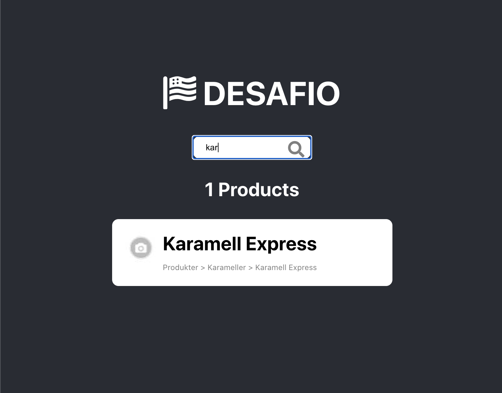

# Desafio - Rui Pirez

## No directorio principal rode primeiro:

### `yarn serve`

para inicializar o servidor local

### `yarn start`

para inicializar o aplicativo

Depois de inicializar abrira automaticamente uma página no
[http://localhost:3000](http://localhost:3000) se não abrir é só passar o link para o seu browser.
